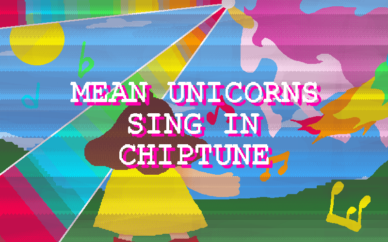

  

<h1 align="center">Mean Unicorns Sing In Chiptune</h1>

**M.U.S.I.C.** is my VERY FIRST entry for the 2026 [JS13K GAME JAM](https://js13kgames.com).
The theme for the competition is **Unicorns and Rainbows**.

The game is a 2D, retro, uncanny-looking rhythm game. Your goal is to survive the mean unicorn's tomfoolery by dodging its rainbow blasts until the song ends.

> For a long long time, it's tradition for unicorns to bow down to the purest of maidens... but these mean ones would rather have them dance!
>
> Prove you're worthy to ride them and complete all FIVE songs!

# Yap Session

Holy moly, didn't know it was possible to create a 13kb game nowadays. I've been researching at past entries, especially **CLAWSTRIKE**. So thank you @remvst for making CLAWSTRIKE which enabled me to understand more about compression via reading your code! I almost lost my way thinking I can do this by just writing all of the code in a single index.html file!

My biggest and hardest challenge is making the music, I can barely make a song by myself, so much which especially made it worse when I had to code it myself instead of foraging from the internet!

Songs tend to be 6MB and no matter how much I compress them either it sounds really bad or the it barely reaches 5kb, farthest i could compress a 6MB music file is 300KB!! Not close!! I hate it!!! I even tried converting it into a Base64 string and creating a reader of sorts but I clearly had NO IDEA what I was doing, so I scrapped it!

So if you think the music is a||ss||, I'M SORRY OKAY?!! I DID MY BEST!! PLEASE SPARE ME!!

Anyways, if someone's even reading this, I know nobody will, that means you were intrigued enough by my work (or you're an admin who needs to check github pages for some reason). But anyways, **thanks for checking out my game!**

# License

Yeah I like to keep my rights to this, you may read the code but don't use it for commercial purposes.

Honestly, you can probably make something better than this anyways.